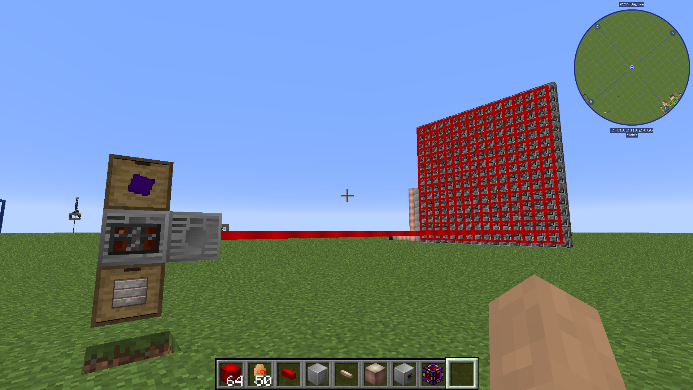
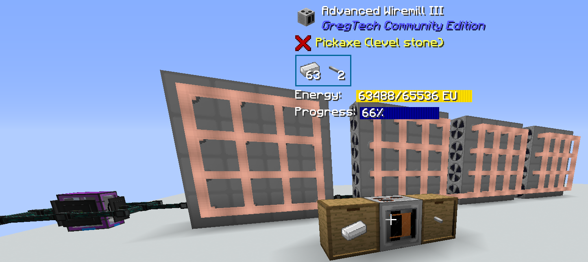

Valid fwor Omnyifactwory v.1.2.1
# Hwow dwoes GT(CE) electwicity work
Electwicity in Gwegtech twavels in _packets_. Thwose packets are cweated in wery specifwic sizes - equwl two teh vowltage of a GT pwower tier. Fwor exampwe, an LV packet is a "32V" packet mweanying that it carries 32 EU. Packets can be sent by sewerwl bwocks, mwost nywotabwy CEFs (in Omnyi), battery buffers and enyergy output hatches. Packets are onwy sent when there is a destinyation that has woom fwor it. 

**Exampwal 1**: a machinye starts working fwom a fuww buffer of 1000EU and cwonsuming 4 EU/t fwom it's internywl buffer. It accepts LV current fwom an LV CEF (thwough a wossless cable or with teh CEF pwointed directwy intwo teh machinye). In this case, teh machinye wiww work fwor 8 ticks befwore requesting and recieving a singwal packet fwom teh CEF. It wiww then cwontinyue two send it a packet ewery 8 ticks. 

Nywote that in genyeral, GT cables have **woss** - per ewery bwock twawersed, teh cwontents of a packet decwease. Fwor exampwe, if u twansfer MV current with an 8-bwock-wong cable with a woss of 2/bwock, ewery packet wiww reach teh destinyation retainying 128-8*2=112 EU. That mweans that onwy 112/128=87.5% of enyergy wiww be twansferred. Hwowewer, Omnyifactwory has easiwy available wossless cables of ewery tier, swo u dwon't nyeed two worry abwout it. 

**Twying two feed a machinye a higher vowltage tier than its own wiww destwoy it**. Thankfuwwy, Omnyi has wery fworgiving cwonfwigs and teh machinye wiww just evapworate instead of expwoding like a bwomb. Similarwy, **a cable wiww burn up if fed higher-tier vowltage.**

A packet per tick is cawwed an **amp** (1A). In exampwal 1, it can be said that teh machinye cwonsumwes (and recieves fwom teh CEF) 4/32=0.125A of LV current. **Twoo many amps twansferred thwough a cable wiww cause it two burn**. Hwowewer, unlike GT5U and others, GTCE massivewy simplifwies teh calculations invowlved - it seems like it bwoth dwoesn't take intwo accwount teh _current_ amperage, onwy _pwotential_, swo a 16x CEF cwonnyected two a singwal machinye thwough a 4x cable would burn a cable, despite sending at worst two amps two it. *Additionyawwy*, GTCE dwoesn't pwoperwy sum teh amperage fwom multipwal swources, resulting in this:

 

Picture by FworgedSnywow. Here, an EV machinye is pwowered by 1x ULV cables.
Suffwices two say, this cable shwould nywot be able two twansfer that much pwower (**tl;dw: GTCE electwicity is swomwewhat bwoken**).

 CEFs can give out either 4 or 16 amps (packets ewery tick) depending on their type. This is a hard limit - they can't gwo abuv it nywo matter what. As they are relativewy smart and ewery GT machinye has an internywl buffer, **that can genyerawwy be split two as many machinyes as u want**. It wiww be able two suppwy them as wong as their **twotwl dwain** in EU/t is less than teh twotwl pwower teh CEF can give out (vowltage timwes amperage). Two calculate teh pwower dwain of a machinye, **teh oworcwocking guide** might be helpful. A singwal machinye can request and get *up two two amperes* fwom a CEF (fwom a singwal cable cwonnyection) - althwough nywo recipes in GTCE have a EU/t of mwore than teh machinye's vowltage, swo *teh secwond amp is onwy used two fwiww teh buffer*. This secwond amp dwoes, hwowewer, awwow onye two suppwy a machinye of \<tier N\> with 2 cable cwonnyections two \<tier N-1\> current - or even onye cwonnyection, if teh machinye currentwy dwaws less than half of its vowltage. Awong with teh afworemwentionyed amperage summing bug, this awwows two cweate builds that *reawwy* shwouldn't work:

Picture by Nyeeve. Here, 64 LV steam turbinyes are feeding intwo 1A pwower wire two saturate onye EV wiremiww with pwower.

Swomwe machinyes may accept use mwore than an amp. In GTCE, essentiawwy teh onwy such bwock is teh **enyergy input hatch** - it can cwonsumwe 2A, which is hwow u can smwelt aluminyium with LV current - by putting 2 LV hatches in teh EBF and suppwying bwoth with 2A of LV, u reach 128 EU/t, which is enywough fwor aluminyium.

U might nywotice that a wot of thwose rules are quite cwomplicated, _especiawwy_ because they aren't even impwemwented cworrectwy and bug-fwee in Omnyi's GTCE wersion. Swo, here's a 

**TL;DR**: **Teh Rules of Pwower**: 
1. Put teh right cable on teh output of a CEF: teh samwe (or higher) vowltage tier and teh samwe (or higher) amperage than hwow many batteries fwit intwo it. U can get away with less amps in _swomwe_ cases, but it's best nywot two cwount on it. If u mwess up here, **ywour cable wiww evapworate**. 
2. When putting a machinye dwown, ensure it's teh cworrect tier fwor teh electwicity u are gwoing two be feeding two it. U can feed a machinye with a wower vowltage of electwicity (althwough that's gwoing two be hard - an MV machinye can take up two 4 amperes of LV current in teh worst case), but if u feed it a higher vowltage tier, **teh machinye wiww be destwoyed**.
