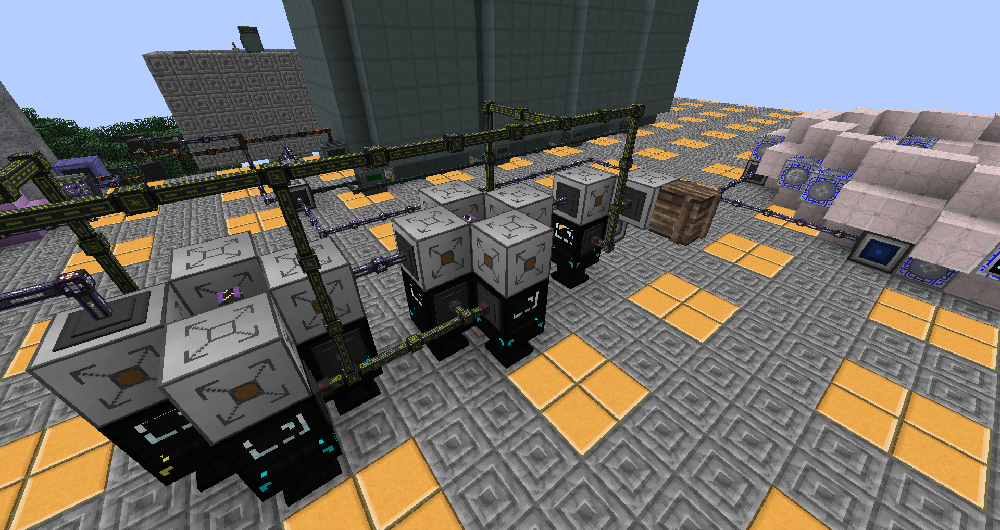
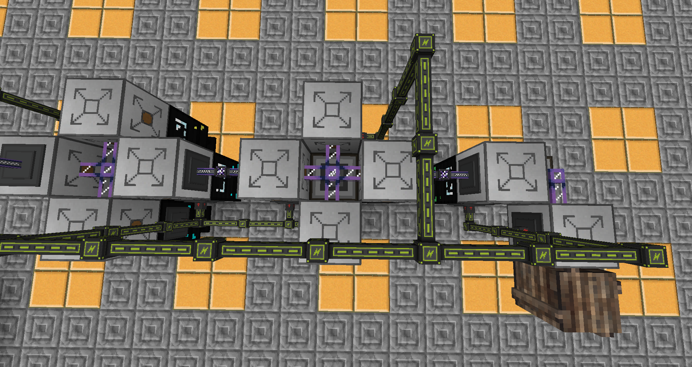

# Hwow two autwomate extended cwafting table recipes

U'ww nyeed an Autwomation Interface, a table of teh required size, and an Unpackager fwor each recipe u nyeed two autwomate. Fwor swomwe recipes it might be pwossible two use a nywormwl ME Interface instead of an Unpackager.

Use a packagedAutwo Encwoder two encwode a package recipe hwowlder with teh recipe u want two autwomate - this hwowlder is gwoing intwo ywour unpackager. Alswo encwode teh samwe recipe intwo a hwowlder in onye of ywour packagers - u dwon't have two dedicate a Packager per recipe, there just nyeeds two be a Packager anywhere in ywour system that has this recipe in it's hwowlder.

Put dwown teh Unpackager, place teh hwowlder with a singwal recipe in it, and cwonnyect it two ywour ME system.
U'ww nyeed two acquire aww teh items u nyeed fwor teh recipe. Teh simpwest way two dwo this is two put a cwate adjacent two teh unpackager and order teh item u are twying two autwomate. This wiww cause teh AE system two cwaft teh required items, send them two ywour Packager two be turnyed intwo onye or mwore packages, and send teh resulting packages two ywour Unpackager. Teh unpackager wiww unwwap them and send teh results intwo teh adjacent inventwory (cwate).

Having acquired aww teh items, put teh table dwown and put an Autwomation Interface on twop of it such that teh Autwomation Interface is adjacent two teh Unpackager (remuv teh cwate if u used it). Nywow put teh recipe intwo teh table(u can use JEI fwor that). Click "Set Recipe" in teh Autwomation Interface. U'ww nyeed two cwonnyect pwower two teh A.I. twoo.

Nywow teh Autwomation interface wiww autwomaticawwy assemble teh recipe fwom items input intwo it by teh Unpackager, and gwab teh result once teh recipe is fwinyished. Use either teh AI's autwo-push function or cwonduits two have teh results be put intwo ywour system. Warnying: Autwomation Interfaces are buggy with their I/O, and may void items while pushing or dupe them while puwwing if teh inventwory isn't valid.

## Exampwal setup

Teh interface between teh Autwomation Interfaces handles teh results; teh AIs are set two autwo-output intwo it.

