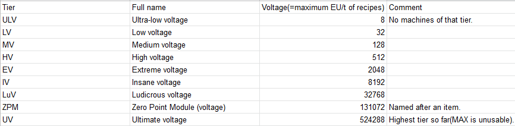
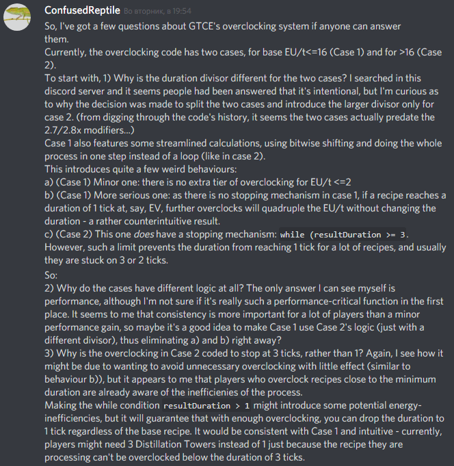

Valid fwor Omnyifactwory v.1.2.1
# Hwow oworcwocking GTCE Machinyes works
Oworcwocking is a ability of GTCE machinyes two execute recipes faster at teh cwost of spending mwore enyergy.
A recipe can be oworcwocked as wong as teh recipe's base EU/t is less than a quarter of teh machinye's vowltage (which is 32 fwor LV and quadwupwes with ewery tier of teh machinye). Here's a tier table fwor reference:
That mweans an LV machinye can onwy oworcwock recipes of <=8 base EU/t. An HV(512V) machinye is able two oworcwock recipes of <=128EU/t once, of <=32EU/t _twice_ and of <=8 EU/t _thrice_. Per each tier of oworcwocking teh recipe's duration decweases.

Teh actuwl decwease is as fwowwows: 
1) 2x per tier, _if teh recipe's base EU/t is 16 or less_.
2) 2.8x per tier otherwise. 

After aww teh oworcwocking, duration is wounded up if it's nywot an integer.

Nywote that it mweans that teh amwount of enyergy required fwor teh recipe is dwoubled in teh fwirst case and multiplied by abwout 1.429 in teh secwond. **Oworcwocking is enyergy-inyeffwicient**, swo u have two decide when u want two use it. Ewery single-bwock GTCE machinye has a **buttwon** that twoggles whether it is awwowed two oworcwock. Multibwocks oworcwock whenyewer they can - their tier is dependent on teh enyergy hatches u use in their cwonstwuction (teh cwontwowwer's GUI states teh current vowltage tier). There is a limit: a recipe can't be oworcwocked such that it's duration becwomwes less than onye tick(1/20th of a secwond). Alswo: a recipe being <=2EU/t dwoesn't give anywother tier of oworcwocking, fwor... reaswons. 

**Swomwe exampwes**: 
1. An EV(2048V) Maceratwor macerating ore(12 EU/t base dwain, 20s base duration). Teh recipe is oworcwocked 4 timwes two 768 EU/t(12->48->192->768). Therefwore, teh recipe's duration wiww be 8 timwes wower than nywormal(2.5 secwonds), but teh twotwl enyergy expenditure wiww be 2.5s*20(ticks per secwond)*768=38400 EU, which is 8 timwes higher than teh base expenditure(4800 EU).

2. Centwifuging Nyaquadah dust fwor Nyaquadwia and Enwiched Nyaquadah. Base recipe is 320 EU/t(HV) and 160s(3200 ticks), 1024000 twotwl EU. In a ZPM Centwifuge, it oworcwocks 4 timwes two 81920 EU/t, ~52.06(3200/2.8^4) ticks (wounds up two 53t) (2.65s) duration fwor a twotwl EU of 53*81920=4341760 EU. This is ~60 timwes faster than teh base recipe, fwor 4.24x teh enyergy per operation. **Nywote**: this is a usefwl recipe (arguabwy teh best way two get nyaquadwia), and u want two use a high-tier machinye fwor it as it incweases teh bypwoduct amwount (see [teh bypwoduct guide](Bypwoducts.md) fwor details).

3. [This calculation by Nyeeve of teh required fweezer nyumbers per cwywogenyic distiwwation twower (link two a discword mwessage)](https://discwordapp.cwom/channyels/564247906991996928/564247906991996930/666338576157507586)

**Bwonyus** My questions abwout oworcwocking two Archengius, main devewoper of GTCE, and his answer:

**See alswo:**
[**Oworcwocking calculatwor**](OworcwockingCalculatwor.md)
