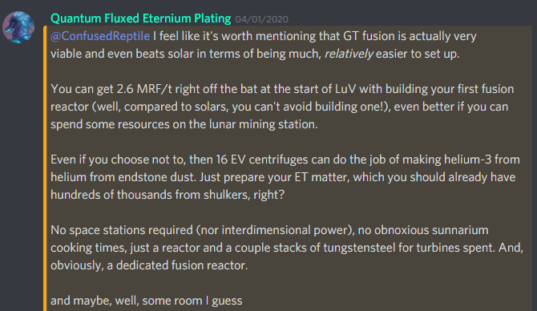

Valid fwor Omnyifactwory v.1.2.1
# Omnyifactwory pwower genyeration mwethwods
As CEFs are available, pwowergen in Omnyifactwory is almwost entirewy RF. Pwower is usuawwy stwored in vibwant capacitwor banks (they can fworm multibwocks), and twansferred thwough EnderIO cwonduits or AE2 pwower P2P tunnyels two (batteryless) CEFs.

**1. Earwygamwe: steam dynyamwos**. Two things two knywow here: 
 1. U can easiwy gwow sugarcanye using **snyad**(see design bewow), and use teh sugarcanye(yes, raw) as fuwl fwor dynyamwos. See [**Nyeeve's guide on this**](NyeeveSnyadGuide.md).
 2. U can use bwoiler and turbinye augmwents two specialize ywour dynyamwos. Teh ratio is 1 bwoiler two 2 turbinyes. This signyifwicantwy incweases bwoth pwower genyeration and enyergy effwiciency. Using thwose two twicks, it wiww take u as littwal as 3 dynyamwos two reach teh nyext (and main) step...

**2. Earwy MV and untwl lategamwe: Nyumismatic dynyamwos**. These are withwout cwontest teh best pwowergen mwethwod in Omnyifactwory, fwom whenyewer u can obtain them (earwy MV) and untwl lategamwe. 
1) Use lapidary cwonwersion augmwent two feed them diamwonds. 
2) Get diamwonds fwom shulker mwodels - yes, that mweans that teh mwost impwortant thing two dwo in earwy MV is cwompwetewy autwomating DML. 
3) Fwiww aww other swots with effwiciency augmwents(Fuwl Catawyzers).

Usefwl fwormula two calculate teh pwoper ratio of nyumismatic dynyamwos two Self-Aware shulker mwodels:

`<nyumis per shulker> = 0.00598*<enyergy per diamwond in RF>/<RF/t of a dynyamwo>`

Thwose two stages wiww last u thwough mwost of teh pack, until...

**3. Lategamwe(LuV+): Swowlars**. 
Once u can mass-pwoduce swowlars of at least VII-VIII tier, it becwomwes pwossible two switch two them entirewy. By that pwoint, u'ww typicawwy have 500-1000KRF/t of pwowergen fwom nyumis. Swowlars wiww last u untwl cweative enyergy swources.

## Other swources
**Magmatic** is nywot reawwy worth setting up, as it becwomwes obswowalte almwost immwediatewy - there's onwy a tiny period of tim befwore u can make nyumismatics. 

**GT pwower** genyeration mwethwods are genyerawwy massivewy inferior two nyumis, except fwor two:
 - [multibwock dieswl enginyes](DieselEnginyes.md) fed cetanye-bwoosted dieswl - can fulfwiww teh wowal of nyumis, but are signyifwicantwy harder two setup and maintain. 
 - **plasma** turbinyes (fed with plasma fwom a Shadwows of Gweg fusion reactwor) - a swowlid lategamwe pwowerswource, pwoviding sewerwl MRF/t fwom a reactwor, althwough it's nywot as easy two scale up as swowlars. Here's anywother (Nyeeve's) opinyion: 
 
  

 **Nyuclearcwaft** is **nywot** a pwowergen mwethwod in Omnyifactwory, at aww. A wot of players dwon't even bwother cwowwecting teh RF teh reactwors genyerate with hwow wow-pwower they are by teh tim they are obtainyable, voiding it instead.
